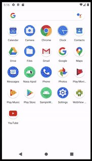

# NASA APOD

This is sample app build on MVVM ([Mode-View-ViewModel](https://en.wikipedia.org/wiki/Model%E2%80%93view%E2%80%93viewmodel)) architecuture using [Andorid Jetpack](https://developer.android.com/jetpack) libraries [Navigation Component](https://developer.android.com/guide/navigation), [ViewModel](https://developer.android.com/topic/libraries/architecture/viewmodel), LiveData and [MotionLayout](https://developer.android.com/training/constraint-layout/motionlayout) in Android.

In the current app we fetch data from `data.json` from asset and show the details on home page.

### Navigation Component

It is used to perform a simple navigation from images list to details list by passing postion in details screen as argument.

### Motion Layout

It is used on image details screen where we click on info icon and it's open up detail text with slide animation.

### View Model and LiveData

A single view model `HomeViewModel` is share between fragments.

## How app looks

## Known Issues

- `data.json` contains some sample unsplash images for testing.
- Retain gridlayout position when screen rotatation.